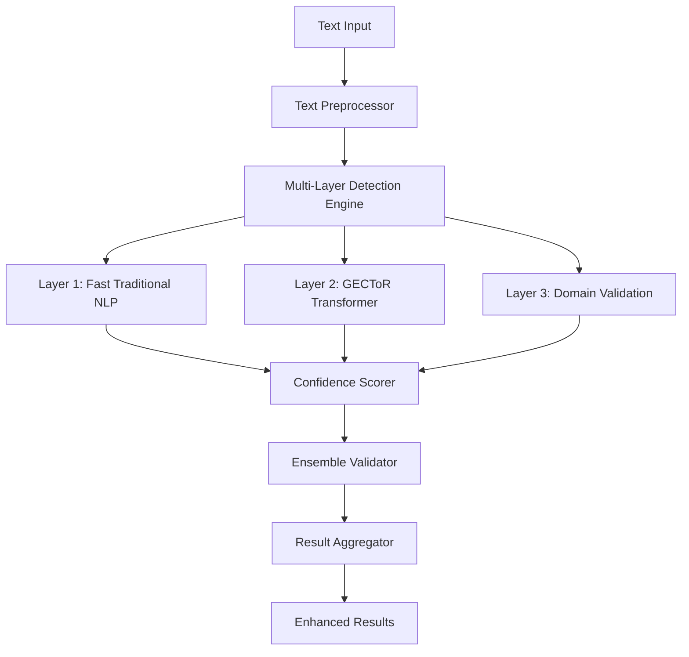

# Enhanced Typo Detection System Design

## Overview

This design outlines a multi-layered typo detection system that combines traditional NLP methods, transformer-based models (GECToR), and domain-specific validation to achieve high accuracy for resume text analysis. The system uses an ensemble approach with confidence scoring and intelligent fallbacks to ensure both accuracy and performance.

## Architecture

### High-Level Architecture



### System Components

1. **Multi-Layer Detection Engine**: Orchestrates different detection methods
2. **Traditional NLP Layer**: Fast spell-checking using pyspellchecker + language-tool-python
3. **GECToR Layer**: Transformer-based correction using pre-trained models
4. **Domain Validation Layer**: Resume-specific vocabulary and context validation
5. **Confidence Scoring System**: Assigns confidence scores to all suggestions
6. **Ensemble Validator**: Combines results from multiple layers intelligently
7. **Performance Monitor**: Tracks accuracy and speed metrics

## Components and Interfaces

### 1. Enhanced Text Analysis Service

```python
class EnhancedTextAnalysisService:
    def __init__(self, config: AnalysisConfig):
        self.traditional_analyzer = TraditionalNLPAnalyzer()
        self.gector_analyzer = GECToRAnalyzer()
        self.domain_validator = DomainValidator()
        self.confidence_scorer = ConfidenceScorer()
        self.ensemble_validator = EnsembleValidator()
        
    def analyze_with_ensemble(self, text: str) -> EnhancedAnalysisResult:
        # Multi-layer analysis with intelligent fallbacks
        pass
```

### 2. Multi-Layer Detection Engine

```python
class MultiLayerDetectionEngine:
    def detect_typos(self, text: str) -> List[LayeredDetectionResult]:
        # Coordinate detection across all layers
        # Apply intelligent caching and chunking
        # Handle fallbacks when layers fail
        pass
        
    def _apply_layer_weights(self, results: List[LayeredDetectionResult]) -> List[WeightedResult]:
        # Apply confidence-based weighting to layer results
        pass
```

### 3. Domain-Specific Validator

```python
class DomainValidator:
    def __init__(self):
        self.tech_vocabulary = self._load_tech_terms()
        self.resume_patterns = self._load_resume_patterns()
        self.industry_terms = self._load_industry_terms()
        
    def validate_suggestion(self, original: str, suggestion: str, context: str) -> ValidationResult:
        # Validate against domain-specific rules
        # Check for technical terms, company names, certifications
        # Apply context-aware validation
        pass
```

### 4. Intelligent Caching System

```python
class IntelligentCache:
    def __init__(self, max_size: int = 10000):
        self.text_cache = {}  # Cache for analyzed text chunks
        self.suggestion_cache = {}  # Cache for validated suggestions
        
    def get_cached_analysis(self, text_hash: str) -> Optional[AnalysisResult]:
        # Return cached results for identical text
        pass
        
    def cache_analysis(self, text_hash: str, result: AnalysisResult):
        # Store analysis results with intelligent eviction
        pass
```

## Data Models

### Enhanced Detection Models

```python
class LayeredDetectionResult(BaseModel):
    layer_name: str
    original_word: str
    suggestions: List[str]
    confidence_scores: List[float]
    detection_method: str
    processing_time: float

class EnsembleResult(BaseModel):
    final_suggestion: str
    ensemble_confidence: float
    layer_votes: Dict[str, float]
    explanation: str
    validation_status: ValidationStatus

class PerformanceMetrics(BaseModel):
    accuracy_score: float
    precision: float
    recall: float
    f1_score: float
    average_processing_time: float
    cache_hit_rate: float
```

### Configuration Models

```python
class AnalysisConfig(BaseModel):
    enable_traditional_nlp: bool = True
    enable_gector: bool = True
    enable_domain_validation: bool = True
    confidence_threshold: float = 0.8
    max_processing_time: float = 3.0
    cache_enabled: bool = True
    fallback_strategy: str = "graceful"
```

## Error Handling

### Graceful Degradation Strategy

1. **Primary Path**: All layers working → Full ensemble analysis
2. **GECToR Failure**: Traditional NLP + Domain validation
3. **Traditional NLP Failure**: GECToR + Domain validation  
4. **Domain Validation Failure**: Traditional NLP + GECToR
5. **Multiple Failures**: Basic spell-checking with reduced confidence

### Error Recovery Mechanisms

```python
class ErrorRecoveryManager:
    def handle_layer_failure(self, layer: str, error: Exception) -> RecoveryAction:
        # Log error and determine recovery strategy
        # Switch to fallback methods
        # Adjust confidence scores accordingly
        pass
        
    def monitor_layer_health(self) -> Dict[str, HealthStatus]:
        # Monitor each layer's performance and availability
        # Trigger proactive fallbacks when needed
        pass
```

## Testing Strategy

### 1. Unit Testing
- Test each detection layer independently
- Validate confidence scoring algorithms
- Test domain validation rules
- Verify caching mechanisms

### 2. Integration Testing
- Test ensemble voting logic
- Validate fallback mechanisms
- Test performance under various load conditions
- Verify end-to-end accuracy

### 3. Performance Testing
- Benchmark processing times for different text sizes
- Test memory usage under load
- Validate cache effectiveness
- Measure accuracy improvements

### 4. Domain-Specific Testing
- Test with real resume samples
- Validate technical term recognition
- Test industry-specific vocabulary
- Measure false positive rates

### Test Data Strategy

```python
class TestDataManager:
    def generate_test_cases(self) -> List[TestCase]:
        # Generate diverse test cases covering:
        # - Common typos in resumes
        # - Technical terms and jargon
        # - Edge cases and corner cases
        # - Performance stress tests
        pass
        
    def validate_accuracy(self, results: List[AnalysisResult]) -> AccuracyMetrics:
        # Calculate precision, recall, F1 score
        # Compare against ground truth data
        # Generate detailed accuracy reports
        pass
```

## Performance Optimization

### 1. Intelligent Text Chunking
- Split large texts into optimal chunks for each layer
- Preserve context across chunk boundaries
- Parallel processing of independent chunks

### 2. Adaptive Layer Selection
- Use fast layers first, slower layers only when needed
- Skip expensive layers when confidence is already high
- Dynamic layer weighting based on historical performance

### 3. Smart Caching Strategy
- Cache at multiple levels (text chunks, suggestions, validations)
- Use content-based hashing for cache keys
- Implement intelligent cache eviction policies

### 4. Resource Management
- Lazy loading of heavy models (GECToR)
- Memory-efficient batch processing
- GPU utilization when available

## Deployment Considerations

### 1. Model Management
- Version control for ML models
- A/B testing framework for model updates
- Rollback capabilities for failed deployments

### 2. Monitoring and Observability
- Real-time accuracy monitoring
- Performance metrics dashboard
- Error rate tracking and alerting

### 3. Scalability
- Horizontal scaling for high-load scenarios
- Load balancing across detection layers
- Auto-scaling based on demand

## Security and Privacy

### 1. Data Protection
- No persistent storage of user text
- Secure handling of temporary data
- Compliance with privacy regulations

### 2. Model Security
- Secure model loading and validation
- Protection against adversarial inputs
- Regular security audits

This design provides a robust, scalable, and accurate typo detection system that can achieve the 85% F1 score target while maintaining sub-3-second processing times for typical resume text.